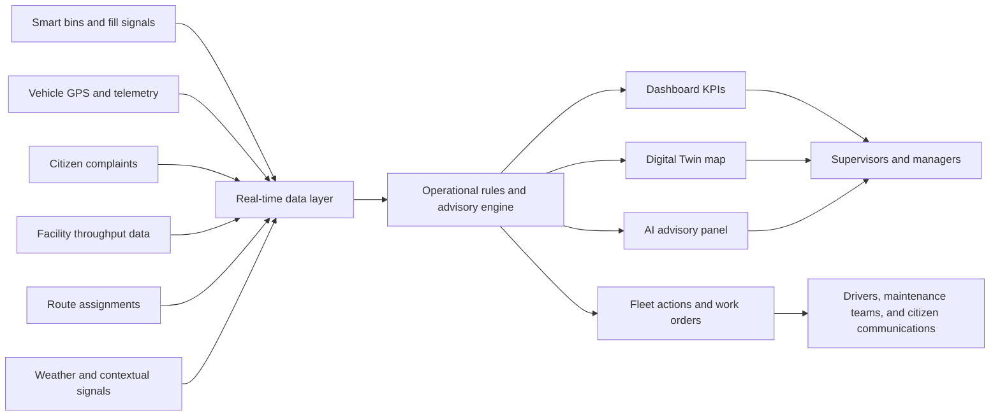
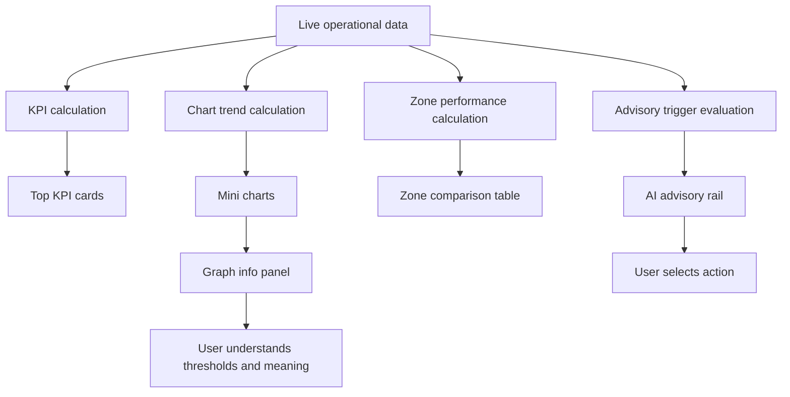
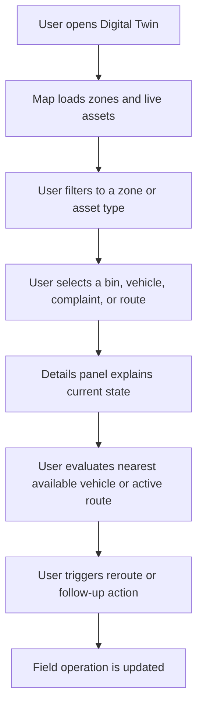
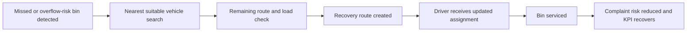
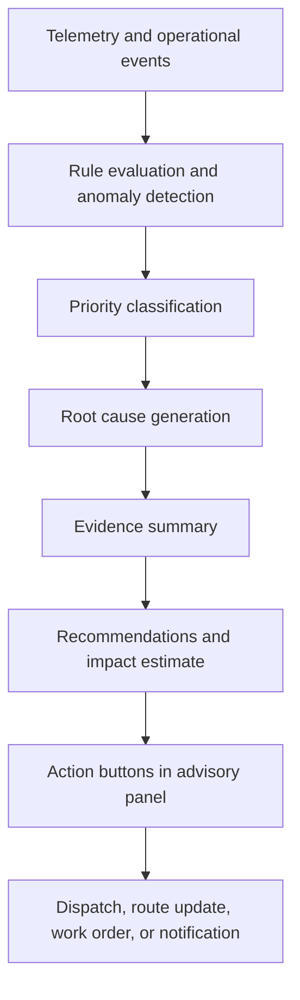
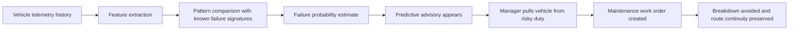
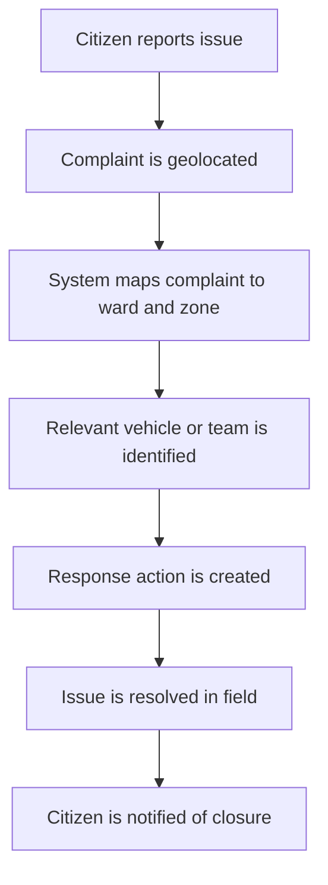
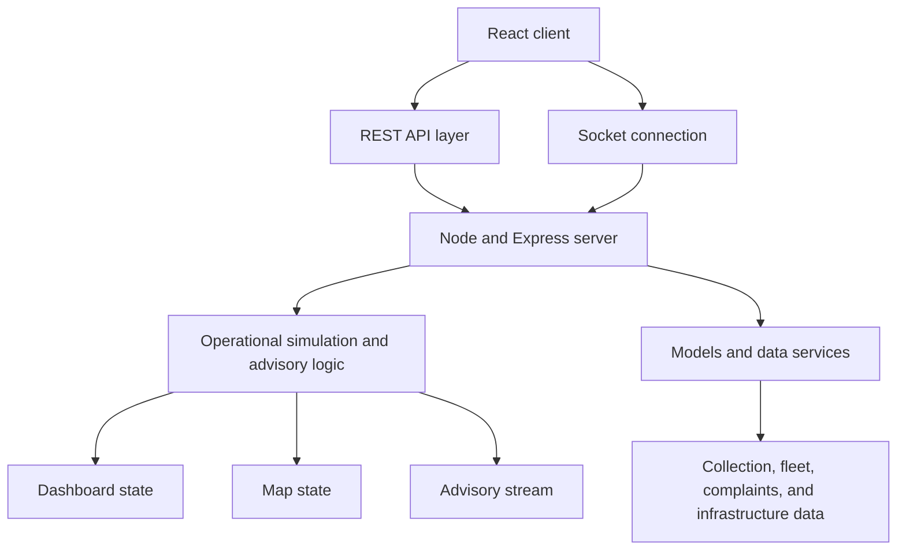
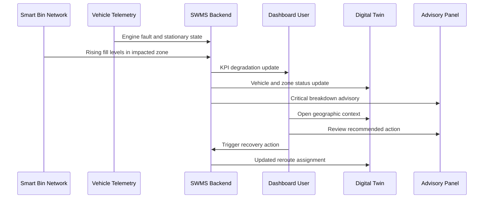
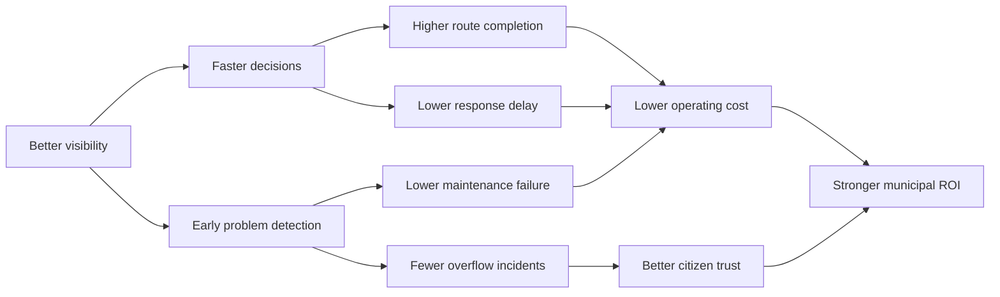

# Smart Waste Management System (SWMS) - Colombo

## Investor Walkthrough and Product Narrative

Document version: 3.0
Prepared for: Investors, municipal decision makers, strategic partners, and technical evaluators
Prepared on: April 20, 2026
Project scope: Smart municipal solid waste operations for Colombo

---

## 1. Purpose Of This Document

This walkthrough is designed to explain the application in a way that is commercially clear, operationally concrete, and technically credible.

It is intentionally detailed.

It does not only describe what the platform is.

It also explains why the platform matters, how the system behaves during a real operating day, what each major screen contributes, how the data flows through the platform, and how the investment case is justified.

This document should help an investor answer six questions.

1. What problem is being solved?
2. Why is this problem large enough to matter?
3. How does the platform work in practice?
4. Why is the solution better than current municipal workflows?
5. What makes the product defensible and scalable?
6. Where does the return on investment come from?

---

## 2. Executive Summary

The Smart Waste Management System is a real-time command and control platform for municipal waste operations.

It combines live map intelligence, fleet telemetry, operational dashboards, predictive advisories, and citizen-service workflows into a single system.

The application converts waste management from a reactive service into a coordinated, measurable, and increasingly predictive utility.

In a traditional city environment, waste operations are fragmented.

Collection vehicles follow static routes.

Bins are serviced whether they need service or not.

Breakdowns are handled after they happen.

Citizen complaints arrive after service failure has already become visible.

Facility bottlenecks are discovered too late.

Management teams lack a live operational picture.

This platform fixes that.

It gives decision makers a single operational surface where they can see assets, understand priorities, intervene quickly, and evaluate impact.

At the product level, the platform is built around five core ideas.

1. Live operational visibility.
2. Data-driven prioritization.
3. Actionable intelligence rather than passive reporting.
4. Predictive prevention rather than reactive cleanup.
5. Financially measurable efficiency gains.

At the investor level, the platform creates value through fuel savings, labor productivity, lower vehicle downtime, faster complaint resolution, fewer overflow incidents, and better infrastructure utilization.

At the city level, the platform creates value through cleaner streets, improved accountability, and more resilient public services.

---

## 3. The Problem Being Solved

Waste collection is not merely a logistics problem.

It is an urban reliability problem.

When waste operations fail, the failure is visible to the public immediately.

Overflowing bins create odor, traffic inconvenience, drainage obstruction, pest risk, citizen frustration, and political pressure.

The underlying causes of failure are usually operational rather than strategic.

Vehicles are sent to the wrong places.

Bins are serviced on the wrong schedule.

Critical routes depend on single vehicles.

Supervisors discover issues too late.

Maintenance teams act after breakdowns instead of before them.

Operations teams do not have one place to see the whole system.

In most municipal environments, the common pain points look like this.

- Route plans are static even though waste generation is dynamic.
- Vehicles are dispatched without live awareness of bin density or overflow clusters.
- Breakdowns interrupt route completion and trigger chain failures across wards.
- Complaints arrive without direct linkage to field assets or route recovery plans.
- Transfer stations and landfill inputs are monitored separately from collection performance.
- Management reports are retrospective and do not help same-day execution.

The cost of this fragmentation appears in three forms.

Operational cost.

Public service failure.

Strategic blind spots.

This product addresses all three.

---

## 4. The Solution In One Sentence

The Smart Waste Management System is a unified digital operating layer for urban waste management that shows the live state of the city, identifies the highest-priority issues, recommends the next action, and allows teams to respond before minor inefficiencies become visible service failures.

---

## 5. What The Product Includes

The product is not a single screen.

It is a coordinated set of modules.

Those modules work together as one operating environment.

The application includes the following primary surfaces.

1. Dashboard
2. Digital Twin
3. Waste Collection
4. Fleet Management
5. Processing
6. Landfills
7. WTE Plant
8. Sustainability
9. Enterprise
10. Citizen Services
11. Login and access control experience

These modules are unified by shared operational data.

This means the platform does not behave like disconnected reporting pages.

Instead, each module explains one dimension of the same live city system.

---

## 6. Product At A Glance

| Area | What It Does | Why It Matters |
| --- | --- | --- |
| Dashboard | Shows KPIs, charts, trends, alerts, and live operational posture | Gives executives and supervisors immediate situational awareness |
| Digital Twin | Maps bins, vehicles, staff, zones, complaints, and cameras | Makes the system spatially understandable and actionable |
| Advisory Engine | Produces critical, high, medium, low, and predictive advisories | Turns raw telemetry into decisions |
| Fleet Management | Tracks routes, idling, maintenance, and vehicle availability | Protects route completion and lowers fuel waste |
| Citizen Services | Links complaints to areas and response actions | Improves trust and accountability |
| Processing And Disposal | Tracks flow into treatment, WTE, and landfill endpoints | Connects collection performance to infrastructure outcomes |
| Sustainability | Highlights diversion, efficiency, and environmental impact | Supports ESG and long-term planning |
| Enterprise View | Summarizes operations for leadership-level decision making | Aligns operations with budget, policy, and expansion planning |

---

## 7. High-Level Operating Model

The platform sits between field operations and management control.

On one side are live assets.

Those include smart bins, vehicles, drivers, field teams, route plans, complaints, and facilities.

On the other side are decision makers.

Those include dispatchers, shift supervisors, operations managers, and executive stakeholders.

The application continuously turns field-state changes into operational visibility.

Then it turns visibility into action.

---

## 8. End-To-End Platform Flowchart



This diagram summarizes the core thesis of the product.

The system is not just visualizing data.

It is orchestrating decisions.

---

## 9. Who Uses The Platform

The system creates value for several different user groups.

### 9.1 Dispatch Supervisors

They need to know what is failing right now.

They care about route recovery, overflow prevention, and vehicle utilization.

For them, the most valuable views are the Dashboard, the Advisory Panel, and the Digital Twin.

### 9.2 Fleet Managers

They need to know which vehicles are at risk, which routes are inefficient, which units are idling, and which assets should be pulled for maintenance.

For them, the most valuable views are Fleet Management and the Predictive Advisory tier.

### 9.3 Municipal Leaders

They need to understand service performance, citizen complaints, resource allocation, and budget impact.

For them, the most valuable views are Dashboard, Enterprise, Sustainability, and the ROI narrative.

### 9.4 Citizen Service Teams

They need to know whether reported issues are real, where they are located, who is responsible, and when the issue will be resolved.

For them, Citizen Services and the mapped complaint workflow are critical.

### 9.5 Investors And Strategic Partners

They need to understand the scale of the problem, the product's differentiation, the architecture, and the economic value generated by operational improvements.

This walkthrough is primarily written for that audience.

---

## 10. What The Dashboard Looks Like

The Dashboard is the first place an investor should look because it captures the product in one screen.

It presents a dense amount of information in an organized way.

The screen is structured as a modern command interface.

The visual hierarchy is designed so that a manager can understand the operational state of the city within seconds.

The current Dashboard experience includes the following primary components.

1. KPI cards at the top for immediate operational posture.
2. Mini charts for trend interpretation.
3. Information buttons on charts that open a detailed side panel.
4. Zone-level performance data.
5. Activity or event context for what has changed recently.
6. The AI Advisory Panel, which translates system signals into recommended action.

The Dashboard is not a passive reporting view.

It is a control surface.

The top layer answers, "How are we doing?"

The middle layer answers, "Where is performance changing?"

The right-side intelligence layer answers, "What should we do next?"

---

## 11. Dashboard Screen Walkthrough

An investor walking through the Dashboard should imagine the following user journey.

First, the user lands on the page and sees headline metrics.

Those metrics quickly communicate whether the city's operations are healthy, stressed, or approaching risk thresholds.

Second, the user looks at trend charts.

These charts show whether the day is improving or deteriorating.

Third, the user clicks the information icon on a graph.

This opens a detailed side panel with explanatory context, chart preview, and level indicators.

Fourth, the user reviews zone-by-zone differences.

This makes underperforming districts visible immediately.

Fifth, the user checks the Advisory Panel.

This is where the platform shifts from observation to intervention.

If a vehicle has failed, if a route is leaking productivity, or if a predictive risk is forming, the Advisory Panel explains the issue and proposes concrete action.

This progression matters because it mirrors how real operational leaders think.

They begin with city posture.

They then narrow into problem zones.

They then examine root causes.

They then choose action.

The Dashboard supports exactly that flow.

---

## 12. ASCII Dashboard Mockup

The following sketch is a textual approximation of how the main dashboard experience should be understood by a non-technical audience.

It is not intended as final pixel-perfect UI.

It is intended to illustrate the visual logic of the product.

```text
+--------------------------------------------------------------------------------------------------+
| SWMS DASHBOARD                                    Zone Filter: All Colombo   Live Status: Active |
+--------------------------------------------------------------------------------------------------+
| KPI: Waste Collected | KPI: Route Completion | KPI: Fleet Availability | KPI: Complaints        |
| 482 t today          | 88.5%                | 91%                      | 37 open               |
| trend up             | trend down           | stable                   | trend up              |
+--------------------------------------------------------------------------------------------------+
| Trend Chart: Collection Volume   | Trend Chart: Missed Bins    | Trend Chart: Complaints |
| Line graph + info button         | Bar graph + info button     | Line graph + info btn   |
+--------------------------------------------------------------------------------------------------+
| Waste Composition Doughnut       | Zone Performance Table                                   |
| Organic 71%                      | Zone 1 92% | Zone 2 53% | Zone 3 94% | Zone 4 87% | Z5 81% |
| Plastic 12%                      | color bands show healthy, warning, critical             |
| Paper 9%                         |                                                         |
| Glass 8%                         |                                                         |
+--------------------------------------------------------------------------------------------------+
| Activity Feed                    | AI Advisory Panel                                        |
| V-006 fault at 08:15             | Critical: V-006 breakdown halted Zone 2 route           |
| 17 complaints in Grandpass       | High: V-011 idle 34 minutes during peak window          |
| V-008 completed Zone 3 route     | Predictive: V-009 shows 81% failure risk in 72h         |
| 6 bins above overflow threshold  | Suggestive: Pettah Wednesday surge requires staging     |
+--------------------------------------------------------------------------------------------------+
| Right Slide-In Panel on chart click:                                                   [Close] |
| Title                                                                            Graph Preview |
| About this chart                                                                    Thresholds |
| What good / warning / critical levels mean                                      Recommended use |
+--------------------------------------------------------------------------------------------------+
```

This mockup helps investors quickly understand that the dashboard is composed of three layers.

1. Summary
2. Explanation
3. Action

That is the correct product framing.

---

## 13. Dashboard Features In Detail

### 13.1 KPI Cards

The KPI cards sit at the top because they answer the most important operational questions immediately.

Examples of KPI themes include total collected tonnage, route completion, active complaints, and fleet availability.

These metrics are useful because they are directional.

They tell a leader whether the day is normal or abnormal.

They are also useful because they anchor later interpretation.

If route completion is weak, the charts and advisories below explain why.

### 13.2 Mini Charts

The dashboard includes compact charts that show pattern direction instead of forcing the user to infer trend from raw numbers.

This matters in operating environments because a slightly lower number may still be acceptable if the curve is improving.

Likewise, a still-acceptable number may require intervention if the curve is deteriorating quickly.

### 13.3 Graph Information Panel

The graph information panel is a particularly important feature from a product-quality perspective.

Rather than leaving users with a small cramped tooltip, the system opens a side panel with context.

That panel explains what the chart measures.

It shows the same chart in an enlarged preview.

It adds threshold lines and level indicators.

It transforms a chart from decoration into operational guidance.

### 13.4 Zone Performance Comparison

A city does not fail uniformly.

One zone may be healthy while another is collapsing.

The zone performance view is therefore critical.

It shows which parts of the city are keeping pace and which are drifting into risk.

This is especially valuable for resource reallocation.

If Zone 3 has surplus capacity and Zone 2 is failing, the platform makes that imbalance visible.

### 13.5 Activity Context

High-level charts are more useful when grounded in current events.

If a spike in missed collections is visible, the activity context explains whether that spike was caused by a breakdown, a route gap, a complaint surge, or a facility issue.

This reduces guesswork.

### 13.6 Advisory Panel Integration

The Dashboard is tightly connected to the advisory engine.

That means interpretation does not stop at visualization.

The system actively recommends next steps.

This is one of the strongest investor-facing differentiators in the application.

---

## 14. Dashboard Information Flow



This diagram explains why the Dashboard is central.

It is where several analytical layers converge.

---

## 15. The Digital Twin

If the Dashboard tells the user what is happening, the Digital Twin shows where it is happening.

The Digital Twin is one of the most visually compelling parts of the application.

It represents the waste system as a live geographic model of the city.

Assets are not shown as disconnected records.

They are shown in place.

That spatial context changes the quality of decision-making dramatically.

The Digital Twin maps multiple types of entities.

- Waste bins
- Vehicles
- Zones
- Wards
- Cameras
- Staff positions
- Complaints
- Route overlays

Each of these layers contributes a different piece of the operational picture.

Bins reveal demand.

Vehicles reveal supply.

Zones reveal responsibility.

Complaints reveal citizen impact.

Routes reveal planned motion.

Live positions reveal actual motion.

---

## 16. Why The Digital Twin Matters To Investors

From an investor perspective, the Digital Twin is not only visually attractive.

It is economically significant.

A city operation becomes manageable when it can be understood spatially.

The Digital Twin directly supports the following outcomes.

1. Faster identification of overflow clusters.
2. Clearer assessment of route inefficiency.
3. More accurate recovery of missed bins.
4. Better deployment of spare vehicle capacity.
5. Better explanation of operations to municipal leadership.

It also makes the platform easier to sell.

Maps shorten the path between demonstration and comprehension.

That matters in procurement environments.

---

## 17. Digital Twin Features In Detail

### 17.1 Bin Visualization

Bins are represented with condition-sensitive icons.

The icon styling communicates fill level immediately.

This allows a user to scan for urgency rather than reading labels one by one.

Uniform icon logic across the map also improves interpretability.

### 17.2 Vehicle Tracking

Vehicles are displayed with live status context.

A vehicle is not just visible as a moving point.

The interface indicates whether it is collecting, returning, or inactive.

This matters because idle assets are often hidden productivity leaks.

### 17.3 Route Rendering

Route lines matter because they reveal intended service structure.

The platform uses enhanced route path generation so that movement follows realistic roads instead of simplistic straight lines.

This improves both realism and usefulness.

### 17.4 Geo-Correction And Land Anchoring

The product has already incorporated corrections for bins and map assets that initially appeared inside water bodies.

This is not a cosmetic detail.

It reflects the seriousness of the platform's geographic fidelity.

In city software, map trust matters.

If users do not trust the map, they do not trust the product.

### 17.5 Complaint Context

When complaints are tied to geography, they become operationally actionable.

The team can see where complaints cluster and whether those areas are already on a route or still unserved.

### 17.6 Camera And Staff Layers

Additional context layers support richer decision making.

Camera locations suggest areas with higher visibility or evidence potential.

Staff markers help represent human deployment in the field.

---

## 18. Digital Twin Interaction Flow



This interaction is one of the most important action loops in the product.

It is where geographic visibility becomes operational intervention.

---

## 19. Missed Bin Recovery And Dynamic Rerouting

One of the more practically valuable capabilities in the product is missed-bin rerouting.

In real-world collection operations, missed service is unavoidable.

Road blockages, vehicle delays, route timing conflicts, and breakdowns all create gaps.

The platform responds to these conditions by allowing targeted rerouting.

This is strategically important for two reasons.

First, it minimizes visible failures.

Second, it allows service recovery without redesigning the entire day.

The logic is straightforward.

1. A bin is flagged as missed or at risk.
2. The map reveals its exact location.
3. The system assesses nearby vehicles and available capacity.
4. A recovery route can be generated.
5. The asset is serviced before the failure becomes more visible.

This is a high-value operational feature because it turns the inevitable messiness of field work into a manageable exception path.

---

## 20. Reroute Flowchart



---

## 21. The AI Advisory Panel

The AI Advisory Panel is arguably the most commercially distinctive element in the application.

Many operational systems show dashboards.

Far fewer systems actively interpret operations and recommend interventions.

That distinction matters.

Decision support is more valuable than passive reporting.

The Advisory Panel continuously presents curated operational intelligence.

It is designed to reduce operator cognitive load.

Instead of asking a human to detect patterns across charts, maps, and raw lists, the system summarizes high-impact issues directly.

Each advisory includes several structured elements.

1. A clear title.
2. A priority tier.
3. A root-cause narrative.
4. Evidence.
5. Recommendations.
6. Estimated impact.
7. One-click actions.

This structure is important because it is understandable to both technical and non-technical stakeholders.

---

## 22. The Five Advisory Tiers

The advisories are intentionally diversified so that the product shows different classes of operational intelligence.

### 22.1 Critical Advisories

Critical advisories are for active failures that threaten service continuity now.

Example themes include major vehicle breakdowns, severe overflow clusters, or route collapse in a critical zone.

These advisories are intended to force immediate action.

### 22.2 High-Priority Advisories

High-priority advisories are for efficiency leaks that are not yet catastrophic but are already expensive.

Vehicle idling during peak service windows is a good example.

These issues destroy capacity silently.

### 22.3 Medium-Priority Advisories

Medium-priority advisories address structural risk and operational backlog.

They are often linked to maintenance, scheduling, and overdue service.

These advisories are about protecting the next several days of operations.

### 22.4 Low Or Suggestive Advisories

These advisories are preventive and strategic.

They are often tied to recurring demand patterns such as market surges or event-driven waste spikes.

They show that the system can learn from historical rhythm, not just respond to crisis.

### 22.5 Predictive Advisories

Predictive advisories are the most powerful story for investors because they demonstrate future-oriented value.

These advisories identify issues before visible failure occurs.

The purple predictive advisory tier is designed to feel distinct precisely because it communicates foresight rather than current disruption.

---

## 23. Example Advisory Narratives

The current product includes curated investor-grade advisory scenarios.

Those scenarios are intentionally varied.

They demonstrate that the system understands several different kinds of waste operations problems.

Examples include:

- A critical breakdown in Zone 2 caused by vehicle V-006 failing and leaving 125 points unserved.
- A high-priority vehicle idling case where V-011 and V-014 are wasting peak capacity.
- A maintenance backlog case where overdue vehicles are statistically more likely to fail.
- A zone-performance case where one zone is structurally weaker than the others.
- A suggestive advisory that predicts Pettah market surges and recommends proactive staging.
- A purple predictive advisory that flags probable hydraulic failure before the next shift begins.

This breadth is useful because it demonstrates that the system is not limited to a single class of automation.

It can detect current failures, efficiency issues, planned-demand problems, and probable future failures.

---

## 24. Advisory Engine Flowchart



This is a simple but important diagram.

It shows that the advisory system is not just a text generator.

It is an operational orchestration layer.

---

## 25. Predictive Failure Capability

Predictive maintenance is one of the strongest commercial narratives in the platform.

Municipal fleets often suffer from avoidable breakdowns.

These breakdowns are expensive not only because repairs cost money.

They are expensive because they disrupt route completion, create spillover complaints, reduce trust, and force emergency dispatch decisions.

The predictive advisory tier demonstrates that the application can identify failure signatures before breakdown occurs.

That matters because prevention is usually cheaper than response.

The current predictive story is built around vehicle telemetry patterns such as hydraulic pressure variation, idle fuel consumption, and compaction cycle-time degradation.

These are exactly the kinds of multi-signal indicators that make predictive maintenance financially meaningful.

The key investor point is simple.

This feature does not create value by being intelligent in the abstract.

It creates value by avoiding downtime.

---

## 26. Predictive Maintenance Flowchart



This is the operational logic behind the purple predictive advisory tier.

---

## 27. Why The Purple Predictive Tier Matters

The decision to visually separate predictive advisories is not trivial.

It improves interpretability.

Critical red means the system is already on fire.

Orange high means efficiency is currently leaking.

Yellow medium means structural risk is growing.

Blue low means a future opportunity to optimize is visible.

Purple predictive means something more subtle.

It means the platform can see a likely future failure before the field experiences it.

For an investor, that is one of the clearest markers that the product is evolving from monitoring software into an operational intelligence platform.

---

## 28. Fleet Management Module

Fleet Management is where route execution, asset health, and operational capacity intersect.

The module is important because waste operations are only as reliable as the fleet that serves them.

A city can have excellent route planning in theory and still fail if its vehicles idle excessively, break down, or are scheduled poorly.

The fleet perspective of the platform addresses:

- Live vehicle location
- Active versus idle state
- Load and capacity context
- Route assignment status
- Maintenance exposure
- Breakdown recovery coordination

This module gives supervisors and fleet managers the information needed to protect uptime.

It also gives investors an understandable source of cost reduction.

Fuel spend and maintenance spend are two of the most obvious operating-cost categories in municipal waste systems.

Any platform that improves both categories has a strong ROI story.

---

## 29. Fleet Management Capabilities

### 29.1 Vehicle Activity Status

The system distinguishes vehicles that are collecting from those returning to depot or sitting idle.

This detail matters because a moving asset is not always a productive asset.

### 29.2 Route Awareness

Vehicle position is shown in the context of assigned routes.

This reduces ambiguity.

Supervisors can compare where the vehicle should be with where it actually is.

### 29.3 Idle-Time Detection

Idle detection during peak service windows is a direct productivity safeguard.

If a vehicle is sitting with the engine running while nearby bins are trending toward overflow, the system should identify that as a high-value intervention opportunity.

### 29.4 Maintenance Exposure

By connecting service history and telemetry, the platform begins to treat maintenance as a live operational variable instead of a back-office calendar activity.

### 29.5 Backup And Recovery Logic

When a primary route asset fails, the system should not leave supervisors guessing.

It should reveal which vehicles have surplus capacity and where they are.

The current advisory narratives already tell that story well.

---

## 30. Citizen Services

Citizen Services is where public experience enters the platform.

Waste management software becomes more valuable when it closes the loop between field operations and public feedback.

A complaint is not just a message.

It is a location, a service failure indicator, a trust signal, and a possible escalation path.

The product treats complaints as operational data.

That is the correct design choice.

It means complaints can be mapped, prioritized, assigned, and resolved within the same operating environment.

This is important commercially because municipalities increasingly value systems that improve both internal efficiency and citizen accountability.

---

## 31. Citizen Complaint Lifecycle



This workflow is valuable because it turns a complaint into a traceable service object.

---

## 32. Processing, WTE, And Disposal Infrastructure

A waste platform becomes strategically stronger when it does not stop at collection.

This application acknowledges that collection is only one step in a broader waste value chain.

The Processing, WTE Plant, and Landfills modules extend the platform from field collection into downstream infrastructure intelligence.

That matters for three reasons.

1. It creates a fuller system view.
2. It supports long-term planning rather than day-only execution.
3. It strengthens the environmental and strategic story for investors and city leaders.

When an executive can see collection performance, facility throughput, and landfill pressure in one environment, decision quality improves.

This also opens the platform to broader categories of commercial value, including reporting, optimization, and sustainability planning.

---

## 33. Processing Module Narrative

The Processing module should be understood as the operational bridge between field pickup and material handling.

It answers questions such as:

- How much waste is reaching processing today?
- Is throughput aligned with inflow?
- Are there facility delays that will create backlog upstream?
- Is material mix changing?

This matters because collection success alone is not enough.

If downstream infrastructure cannot absorb incoming material, city operations will still destabilize.

The platform's strength is that it can connect these layers.

---

## 34. WTE Plant Narrative

The WTE Plant module extends the story from waste removal to waste valorization.

From an investor perspective, this is particularly useful because it shows that the platform can support not only sanitation efficiency but also infrastructure economics and sustainability performance.

Waste-to-energy operations need visibility into feedstock, throughput, utilization, and output reliability.

A platform that can connect upstream collection signals with downstream WTE readiness creates a stronger system-wide business case.

It is easier to justify smart collection when it is visibly tied to energy production, diversion rates, and infrastructure efficiency.

---

## 35. Landfills Narrative

Landfills remain a major part of the operating reality for many cities.

The landfill view is important because it gives leaders visibility into site pressure, incoming flow, and long-term viability.

A platform that tracks landfill load helps the city do more than operate the present.

It helps the city protect the future.

This is valuable for budgeting, expansion planning, environmental reporting, and diversion strategy.

---

## 36. Sustainability Module Narrative

The Sustainability module is where operational performance becomes strategic narrative.

This matters to investors because it broadens the addressable value of the platform.

The product is not only about collecting waste faster.

It is about creating measurable environmental performance.

Useful sustainability themes include:

- Waste diversion from landfill
- Better route efficiency and lower fuel burn
- Better utilization of WTE infrastructure
- Reduced unnecessary mileage
- Reduced visible overflow events
- Better planning for recycling or segregation initiatives

This also strengthens the ESG profile of the platform.

---

## 37. Enterprise Module Narrative

The Enterprise view should be read as the management abstraction layer.

It is where operational detail is consolidated into leadership-level interpretation.

Executives generally do not want to inspect individual bins.

They want to understand city performance, budget efficiency, risk, service reliability, and investment priorities.

The Enterprise module therefore matters because it turns operational signals into management language.

That is essential for procurement, governance, and scale.

---

## 38. Feature Inventory By Module

The following inventory summarizes how investors should think about the application's functional depth.

| Module | Feature Themes |
| --- | --- |
| Dashboard | KPIs, charts, zone comparison, graph side panel, activity context, advisory panel |
| Digital Twin | Live map, bins, vehicles, zones, staff, cameras, complaints, route overlays |
| Waste Collection | Service posture, missed collections, collection efficiency, capacity context |
| Fleet Management | Tracking, route state, idling analysis, maintenance exposure, recovery actions |
| Processing | Throughput view, operational load balancing, downstream awareness |
| Landfills | Load pressure, intake awareness, strategic capacity narrative |
| WTE Plant | Energy-linked waste utilization story, readiness and throughput interpretation |
| Sustainability | Diversion, efficiency, environmental outcome framing |
| Enterprise | Leadership summary, performance framing, strategic interpretation |
| Citizen Services | Complaint intake, mapping, response tracking, communication loop |

---

## 39. Page-By-Page Walkthrough

This section is intentionally concrete.

It explains how an investor should interpret each major page or module in the current product structure.

### 39.1 Login

The Login page represents the controlled-entry surface of the platform.

It is important because municipal software is only credible when access is intentional and role-sensitive.

### 39.2 Dashboard

The Dashboard is the operational command summary.

It is the best entry point for demonstrations.

### 39.3 Digital Twin

The Digital Twin is the geographic execution surface.

It shows the city as a living operating model.

### 39.4 Waste Collection

This page should be read as the core service-delivery lens.

It focuses on collection completeness and field performance.

### 39.5 Fleet Management

This page is about the health and behavior of the service fleet.

It reveals whether the city's delivery engine is strong or fragile.

### 39.6 Processing

This page links what is collected to what is handled downstream.

### 39.7 Landfills

This page gives leadership visibility into pressure on final-disposal infrastructure.

### 39.8 WTE Plant

This page strengthens the value chain narrative by linking waste streams to output potential.

### 39.9 Sustainability

This page translates operational performance into environmental narrative.

### 39.10 Enterprise

This page is the executive summary layer for policy and finance alignment.

### 39.11 Citizen Services

This page closes the loop between public reporting and municipal response.

---

## 40. Technical Architecture Overview

The technical architecture is deliberately modern and practical.

The goal is not novelty for its own sake.

The goal is responsive, maintainable, real-time municipal software.

The current codebase structure indicates a React client, a Node and Express backend, and real-time socket communication.

This is an appropriate architecture for a live operational platform.

The product needs:

- Rich UI rendering
- Map interaction
- Charting
- Real-time updates
- API integration
- Event-driven changes

The chosen architecture supports all of these needs.

---

## 41. Architecture Diagram



This architecture is well suited for demonstration, iteration, and future production hardening.

---

## 42. Frontend Experience

The frontend is built to communicate operational seriousness while still being accessible and readable.

It uses a modern component-based structure.

That matters for maintainability and scalability.

Relevant front-end strengths include:

- A consistent page system
- Reusable components for cards, panels, and metrics
- Chart support for multiple data views
- Leaflet-based mapping for the Digital Twin
- Tailwind-driven styling for consistent visual structure
- Side-panel interactions that keep context instead of forcing navigation churn

This design approach is appropriate for municipal operations because users often need information density without clutter.

---

## 43. Backend And Real-Time Layer

The backend is designed to serve both API-driven state and real-time events.

This distinction is important.

Not every piece of data should refresh the same way.

Some views can be fetched.

Other operational signals should be pushed instantly.

That is why the presence of socket-based updates is meaningful.

A reactive city operations interface must feel live.

If a critical breakdown occurs, waiting for the next refresh cycle is too slow.

The system therefore benefits from an event-driven posture.

---

## 44. Data Inputs

An investor should understand the breadth of useful data inputs because that breadth determines how much intelligence the platform can generate.

Relevant data streams include:

- Bin fill levels
- Vehicle GPS traces
- Vehicle status changes
- Maintenance history
- Complaint submissions
- Zone definitions
- Route structures
- Facility context
- Historical activity patterns
- Derived risk scores

The more of these signals the platform can ingest reliably, the more powerful the product becomes.

---

## 45. Security And Governance Considerations

Municipal platforms must be trustworthy.

That means security is not an optional add-on.

Relevant security and governance themes include:

- Controlled user access
- Role-sensitive actions
- Separation between presentation and data services
- Auditability of work orders and decisions
- Clear integration boundaries for future field hardware

For investors, this is important because enterprise readiness affects procurement viability.

---

## 46. Deployment Readiness Narrative

The current structure supports iterative deployment.

A municipal-grade version of the product can be deployed in stages.

This matters because large public-sector technology rollouts often succeed when phased rather than attempted as one giant cutover.

The platform can be introduced through:

1. Dashboard and Digital Twin visibility first.
2. Advisory and fleet decision support second.
3. Predictive maintenance and deeper automation third.
4. Facility and sustainability integration fourth.

This phased model reduces implementation friction and improves commercial adoption.

---

## 47. Daily Operations Scenario

To understand the product at a practical level, it helps to imagine a single operating day.

### 06:00

Routes are initialized.

Vehicles begin moving.

The Dashboard reflects healthy starting posture.

### 07:30

Fill levels rise in commercial pockets.

The Digital Twin begins to show where demand is accelerating.

### 08:15

Vehicle V-006 fails in a key service zone.

Route completion immediately weakens.

The Advisory Panel surfaces a critical breakdown advisory.

### 08:20

A zone imbalance becomes visible.

A spare-capacity vehicle from a healthier zone is identified.

### 08:25

Supervisors inspect the Digital Twin.

They confirm asset positions, compare route status, and evaluate the recovery plan.

### 08:30

The recovery route is launched.

The city avoids a full-day route collapse.

### 09:30

Citizen complaints begin rising in the impacted area.

The complaint clusters align with the affected zone on the map.

### 10:00

The graph info panel helps leadership see the meaning of current performance dips and whether the city is recovering.

### 11:30

Another vehicle completes an earlier route and becomes available.

The Advisory Panel recommends redeployment.

### 12:00

Predictive telemetry patterns flag another vehicle as high risk for future failure.

Maintenance is scheduled before the next shift.

### 14:00

The city ends the day with partial disruption but without systemic collapse.

This is exactly the kind of difference the platform is designed to create.

---

## 48. Sequence Diagram For A Real Operating Event



---

## 49. Investor Value Creation Logic

Investors do not need the product to be interesting.

They need it to be valuable.

The platform creates value through several mechanisms.

### 49.1 Fuel Savings

Dynamic route awareness and idle detection reduce unnecessary mileage and engine-on waste.

### 49.2 Better Labor Utilization

A team that knows what matters can respond faster and with less duplication.

### 49.3 Lower Breakdown Cost

Predictive and maintenance-focused advisories reduce catastrophic in-route failure.

### 49.4 Fewer Overflow Events

Overflow prevention reduces visible city failure and downstream escalation costs.

### 49.5 Better Asset Utilization

Spare capacity in one part of the system can be used to rescue weakness in another.

### 49.6 Better Leadership Decision Quality

Faster, clearer decisions reduce waste across the operating model.

---

## 50. Value Creation Diagram



---

## 51. Financial Narrative

The financial case for the platform should be presented in operational terms rather than vague software terms.

A city does not buy dashboards for their own sake.

It buys better outcomes.

The strongest cost categories to emphasize are:

- Fuel consumption
- Reactive maintenance
- Route inefficiency
- Emergency dispatch cost
- Complaint handling cost
- Service breach and SLA-related pressure

The platform directly touches all of these areas.

That makes the ROI case much easier to defend than a purely analytical product.

---

## 52. Example ROI Table

| Efficiency Area | Traditional Pattern | SWMS-Enabled Pattern | Value Outcome |
| --- | --- | --- | --- |
| Vehicle Routing | Fixed routes regardless of demand | Dynamic, demand-aware response | Lower fuel burn and better productivity |
| Breakdown Handling | Repair after failure | Detect risk and act earlier | Lower downtime and recovery cost |
| Complaint Management | Resolve after escalation | Map and close loop faster | Better public trust and lower service friction |
| Overflow Prevention | Discover after street-level failure | Spot trend and intervene | Lower visible service failure |
| Facility Coordination | Separate operational silos | Linked collection and downstream awareness | Better whole-system efficiency |

---

## 53. Why This Product Is Sellable

Some software is technically interesting but commercially hard to explain.

This product is easier to sell because each major capability can be demonstrated visually and justified operationally.

The Digital Twin demos well.

The Dashboard demos well.

The Advisory Panel demos well.

The predictive purple advisory demos especially well because it tells a simple story.

"We can see likely failure before it happens, and we can save money by acting earlier."

That is a highly understandable value proposition.

---

## 54. Competitive Differentiation Themes

An investor should see several differentiators in the current platform direction.

1. Geographic operational intelligence rather than spreadsheet reporting.
2. Actionable advisories instead of passive alerts.
3. Predictive maintenance narrative grounded in operational cost.
4. Multi-module coverage from collection through disposal and sustainability.
5. Strong demonstration value through real-time interfaces.

These differentiators matter because municipal software markets often reward systems that are easy to pilot and easy to defend in governance conversations.

---

## 55. Implementation Strategy

Cities typically adopt complex software in phases.

That is a strength, not a weakness.

The product is well suited to phased implementation.

### Phase 1

Launch Dashboard and Digital Twin with live operational awareness.

### Phase 2

Introduce Advisory Panel decision support and response workflows.

### Phase 3

Enable deeper fleet analytics and predictive maintenance logic.

### Phase 4

Integrate downstream facility intelligence, sustainability views, and broader executive reporting.

This rollout path makes the system commercially realistic.

---

## 56. Risks And Mitigations

No serious investor document should ignore risk.

The platform's credibility improves when risk is acknowledged clearly.

### Risk: Incomplete field data

Mitigation: Start with the strongest data streams first and grow coverage incrementally.

### Risk: User overload

Mitigation: Keep dashboards layered, use advisories for prioritization, and support role-based views.

### Risk: Municipal procurement complexity

Mitigation: Demonstrate fast pilot value through the most visible modules first.

### Risk: Operational distrust of map accuracy

Mitigation: Continue geographic refinement and asset correction, including land-anchoring and zone fidelity.

### Risk: Predictive claims without clear business grounding

Mitigation: Tie every predictive recommendation to avoided downtime and avoided cost.

---

## 57. Product Maturity Signals Already Visible

Even in its current state, the product already shows several maturity signals.

- A coherent multi-page experience
- A real Digital Twin rather than a static map
- Structured advisory logic instead of ad hoc text
- A detailed graph information side panel for better analytical interpretation
- Geographic corrections for coastal asset placement
- A predictive advisory tier that communicates future-facing intelligence
- Operational storytelling that links zones, vehicles, bins, and complaints

These are meaningful signals because they indicate thoughtful product shaping rather than a loose collection of prototypes.

---

## 58. How To Demonstrate The Product To Investors

The best investor demo sequence is usually the following.

1. Open the Dashboard.
2. Explain the KPI cards.
3. Click a chart info button and show the side panel.
4. Open the AI Advisory Panel and walk through the critical, high, and predictive advisories.
5. Move into the Digital Twin and show bins, vehicles, and route recovery logic.
6. Explain how complaints map into operations.
7. Return to the ROI story.

This sequence works because it moves from broad picture to operational detail to commercial value.

---

## 59. Recommended Investor Talking Points

When presenting the application, the most effective talking points are these.

- This is not only a dashboard; it is a city operations layer.
- The product connects visibility, explanation, and action in one environment.
- The platform reduces cost by preventing operational waste, not merely by reporting on it.
- The predictive advisory tier is a strong example of monetizable intelligence.
- The Digital Twin makes municipal operations understandable at a glance.
- The system supports phased rollout, which lowers adoption friction.
- The product can grow from collection intelligence into broader infrastructure intelligence.

---

## 60. Dashboard Features Checklist

- Live KPI cards
- Zone filter
- Mini charts
- Doughnut, bar, and line visualizations
- Information buttons on charts
- Right-side graph detail panel
- Threshold indicators
- Zone performance overview
- Activity context
- Embedded AI advisory visibility

---

## 61. Digital Twin Features Checklist

- Live map canvas
- Bin icons with fill-level logic
- Vehicle markers
- Status-aware vehicle behavior
- Camera markers
- Complaint markers
- Staff markers
- Zone overlays
- Route overlays
- Reroute interaction path
- Geographic correction and land anchoring

---

## 62. Advisory Engine Features Checklist

- Structured priority tiers
- Critical operational incidents
- High-priority efficiency analysis
- Medium-priority maintenance risk
- Low-priority suggestive trend guidance
- Purple predictive failure guidance
- Root cause text
- Evidence text
- Recommendation text
- Impact estimation
- One-click action flow

---

## 63. Fleet Features Checklist

- Vehicle state visibility
- Route state awareness
- Idle detection
- Maintenance context
- Risk identification
- Backup capacity logic
- Recovery routing support

---

## 64. Citizen Service Features Checklist

- Complaint intake
- Geographic complaint mapping
- Zone assignment
- Response visibility
- Closure communication
- Accountability loop

---

## 65. Sustainability And Infrastructure Features Checklist

- Processing awareness
- WTE narrative
- Landfill pressure framing
- Diversion story
- Environmental outcome framing
- Executive-ready sustainability view

---

## 66. Product Roadmap Themes

The current platform is strong enough to support a credible roadmap.

The best roadmap themes build on the product's existing strengths.

Examples include:

- Better predictive models
- More granular route optimization
- Richer complaint analytics
- More automated field dispatching
- Better facility balancing
- Stronger executive reporting
- Deeper ESG measurement
- External integrations with traffic and sensor ecosystems

This is important because investors want to see not only present value but also product extensibility.

---

## 67. Why The Product Matters Now

Cities are under pressure to do more with limited resources.

They are expected to provide cleaner streets, better accountability, more reliable service, and more measurable sustainability outcomes.

At the same time, operational complexity keeps rising.

That makes this class of software increasingly relevant.

The value proposition is not speculative.

It is grounded in recurring municipal pain.

That makes timing favorable.

---

## 68. Long-Term Strategic Opportunity

While the current product is positioned around waste management, the architectural and operational pattern has broader relevance.

Any urban service that involves field assets, route logic, citizen feedback, and infrastructure pressure can benefit from the same operating model.

That suggests optionality.

It does not mean the product should lose focus.

It means the underlying approach has room to expand.

For investors, that increases strategic attractiveness.

---

## 69. Frequently Asked Questions

### Q1. Is this mainly a dashboard product?

No.

The dashboard is the entry point, but the real value comes from combining dashboards, maps, advisories, and action workflows.

### Q2. What is the strongest differentiator?

The combination of real-time Digital Twin visibility and action-oriented advisories is currently the strongest differentiator.

The purple predictive advisory tier is especially persuasive.

### Q3. Why does the Digital Twin matter so much?

Because waste operations are geographic by nature.

A city team makes better decisions when the system is visible spatially.

### Q4. Why is predictive maintenance valuable?

Because avoided downtime is cheaper than emergency failure.

That is a direct cost story, not a vague AI story.

### Q5. Is the platform only useful for collection teams?

No.

It supports dispatch, fleet, leadership, citizen service, sustainability, and downstream infrastructure planning.

### Q6. Can the product be rolled out incrementally?

Yes.

That is one of its commercial strengths.

### Q7. Is the system visually demonstrable to non-technical stakeholders?

Yes.

The Dashboard, Digital Twin, charts, and advisories are all easy to demonstrate.

### Q8. Does the product already communicate operational intelligence rather than raw data?

Yes.

That is what the advisory engine is designed to do.

---

## 70. Glossary

Dashboard
: The main command surface summarizing live operational posture.

Digital Twin
: The map-based live representation of the city's waste system.

KPI
: Key performance indicator used to summarize operational health.

Advisory
: A structured recommendation generated from live or historical signals.

Critical Advisory
: A same-day intervention alert for active failure.

Predictive Advisory
: A future-oriented risk alert that identifies likely failure before visible disruption.

Route Recovery
: A targeted service adjustment designed to rescue missed or at-risk assets.

WTE
: Waste-to-energy processing infrastructure.

Zone
: A defined operational geography inside the city.

Ward
: A smaller service area within the broader zone structure.

---

## 71. Appendix A: Illustrative Screen Narrative

The investor should imagine the product as a sequence of increasingly specific answers.

The Dashboard answers:

How is the city doing right now?

The Graph Info Panel answers:

What does this trend mean and how serious is it?

The Advisory Panel answers:

What exactly should we do next?

The Digital Twin answers:

Where is the problem and what assets are nearby?

The Fleet Management view answers:

Which vehicles are helping, which are wasting time, and which are at risk?

The Citizen Services view answers:

What is the public experiencing and are we closing the loop?

The Sustainability and Enterprise views answer:

How does all of this roll up into strategic performance?

This layered-answer model is a strong way to present the product in conversation.

---

## 72. Appendix B: Example Demo Script

Open the Dashboard and state the city posture.

Point to the top KPI cards and summarize the day's status.

Open a chart info panel and explain threshold interpretation.

Show the zone table and highlight imbalance between healthy and weak zones.

Open the advisory panel and read one critical advisory and one predictive advisory.

Explain the difference between reacting to a failure and preventing one.

Switch to the Digital Twin and show the exact spatial context of the problem.

Click a relevant asset and explain recovery logic.

Return to the commercial narrative and tie the intervention to avoided cost.

This script keeps the demonstration tight, visual, and commercially meaningful.

---

## 73. Appendix C: Feature-To-Benefit Mapping

| Feature | Immediate User Benefit | Business Benefit |
| --- | --- | --- |
| KPI cards | Faster situational awareness | Better daily decision speed |
| Graph info panel | Better understanding of thresholds | Fewer interpretation errors |
| Advisory panel | Clear recommended actions | Higher operational responsiveness |
| Predictive advisory tier | Early risk visibility | Lower downtime cost |
| Digital Twin | Spatial clarity | Faster dispatch and recovery |
| Route overlays | Better route understanding | Improved productivity |
| Complaint mapping | Faster issue localization | Better citizen trust |
| Fleet risk visibility | Better maintenance planning | Lower repair and outage cost |
| Sustainability module | Clear environmental framing | Stronger ESG positioning |

---

## 74. Appendix D: Why The Product Feels Credible

The product feels credible because the experience is rooted in operational reality.

It includes the messy details that real city systems need.

Bins are mapped.

Vehicles have state.

Zones vary.

Breakdowns matter.

Complaints cluster geographically.

Facility pressure exists downstream.

Advisories are tied to plausible actions.

Predictive recommendations are framed in terms of avoided failure.

This realism is important.

It means the product story is not abstract.

---

## 75. Final Investor Conclusion

The Smart Waste Management System should be understood as a practical intelligence layer for city sanitation operations.

Its value comes from making municipal waste systems more visible, more responsive, and more predictable.

It is strong as a demonstration product because it is visual.

It is strong as an operating product because it is actionable.

It is strong as an investment story because it links intelligence directly to avoided cost and better service outcomes.

The Dashboard shows the city posture.

The Graph Info Panel explains the trends.

The Advisory Panel recommends action.

The Digital Twin shows the exact geographic context.

The fleet and infrastructure modules broaden the platform from collection management into full operational intelligence.

The purple predictive tier points toward the future of the product.

It signals that the platform is capable of moving from monitoring the city to anticipating the city's operational failures before the public sees them.

That is the strongest long-term opportunity embedded in the current application.

---

## 76. Closing Statement

For investors, the core takeaway is straightforward.

This is not software that merely reports what happened.

It is software that helps a city operate better today and prepares it to operate more intelligently tomorrow.

That is a meaningful place to build.
